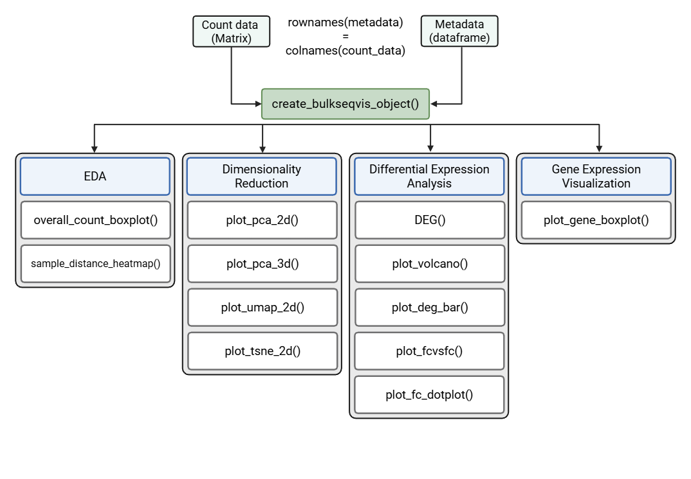

# bulkseqviz: Streamlined Visualization for Bulk RNA-Seq Data

[](https://github.com/MobinKhoramjoo/bulkseqviz/releases)
[](https://opensource.org/licenses/MIT)
[](https://lifecycle.r-lib.org/articles/stages.html#experimental)

**bulkseqviz** is an R package designed to simplify the downstream analysis and visualization of bulk RNA-sequencing data. Built on an S3 object-oriented framework, it wraps complex workflows, including normalization, differential expression (DESeq2), and dimensionality reduction (PCA, UMAP, t-SNE) into intuitive, one-line functions.

## 📦 Installation

You can install the development version of bulkseqviz from GitHub with:

```         
# install.packages("devtools")
devtools::install_github("MobinKhoramjoo/bulkseqviz")
```

## 🚀 Key Features

-   **Unified Data Object:** Bundles counts and metadata into a single validated `bulkseq` object.

-   **Differential Expression:** Wrappers for `DESeq2` that handle design formulas and results extraction automatically.

-   **Publication-Ready Plots:** adjustable with `ggplot2`.

## 🧪 Analysis Workflow

This section demonstrates a comprehensive analysis pipeline using simulated data.



### 1. Data Simulation and Setup

First, we load the package and simulate a dataset representing a typical experiment with multiple conditions (Control, Treatment A, Treatment B) and biological replicates.

```         
library(bulkseqviz)

# Set seed for reproducibility
set.seed(42)

# Define experiment parameters
n_genes <- 10000
n_samples <- 18

# 1. Generate Synthetic Count Matrix
# Start with random base counts (background noise)
counts <- matrix(
  as.integer(sample(10:2000, n_genes * n_samples, replace = TRUE)),
  ncol = n_samples
)
colnames(counts) <- paste0("Sample_", 1:n_samples)
rownames(counts) <- paste0("ENSG", sprintf("%04d", 1:n_genes))

# 2. Generate Metadata
# Conditions: 4 Controls, 4 Treatment A, 4 Treatment B
metadata <- data.frame(
  condition = factor(rep(c("Control", "TreatA", "TreatB"), each = 6), 
                     levels = c("Control", "TreatA", "TreatB")),
  batch = rep(c("Batch_1", "Batch_2"), times = 9)
)
rownames(metadata) <- colnames(counts)

# Preview the metadata
print(head(metadata))
```

### 2. Creating the Analysis Object

The `bulkseq` object acts as a container for your raw counts and metadata, ensuring data integrity throughout the analysis.

```         
bs_obj <- create_bulkseqvis_object(counts = counts, metadata = metadata)

# Print object summary
print(bs_obj)
```

### 3. Quality Control (QC)

Before running statistical tests, it is crucial to assess the quality of the data.

#### A. Overall Count Distribution

We examine the distribution of raw counts to ensure samples are comparable.

```         
overall_count_boxplot(bs_obj, color_by = "condition")
```

#### B. Sample-to-Sample Distance

This heatmap visualizes the similarity between samples. Replicates within the same group should be highly correlated (dark blue).

```         
sample_distance_heatmap(bs_obj, color_by = "condition", fontsize = 9)
```

### 4. Dimensionality Reduction

Visualizing sample clustering using various algorithms.

#### A. PCA (2D)

PCA projects the high-dimensional gene expression data into 2D space. Samples should cluster by condition.

```         
# 2D PCA colored by condition, shaped by batch
plot_pca_2d(bs_obj, color_by = "condition")
```

#### B. PCA (3D)

Interactive 3D visualization of Principal Components.

```         
# Generates an interactive plotly object
plot_pca_3d(bs_obj, color_by = "condition")
```

#### C. UMAP

Uniform Manifold Approximation and Projection for non-linear dimensionality reduction.

```         
plot_umap_2d(bs_obj, color_by = "condition")
```

#### D. t-SNE

t-Distributed Stochastic Neighbor Embedding.

```         
plot_tsne_2d(bs_obj, color_by = "condition")
```

### 5. Differential Expression Analysis

We perform Differential Expression (DE) analysis using `DESeq2` wrapped inside the `DEG()` function.

-   **Design:** We control for `condition`.

-   **Contrasts:** We compare each treatment against the control.

```         
# Contrast 1: Treatment A vs Control
# use one of BioMart databases to map IDs to symbols for visualization.
#NULL is used for this tutorial
bs_obj <- DEG(bs_obj, 
              design_col = "condition", 
              compare_levels = c("TreatA", "Control"),
              biomart_dataset = NULL
              )

# Contrast 2: Treatment B vs Control
bs_obj <- DEG(bs_obj, 
              design_col = "condition", 
              compare_levels = c("TreatB", "Control"),
              biomart_dataset = NULL
              )
```

### 6. Visualization of Results

#### A. Volcano Plots

Volcano plots display statistical significance (\$-\\log\_{10} \\text{FDR}\$) versus magnitude of change (\$\\log_2 \\text{Fold Change}\$).

```         
plot_volcano(bs_obj, 
             comparison_id = "TreatA_vs_Control", 
             top_labels = 5,
             plot_title = "Volcano: Treatment A vs Control"
             )
```

#### B. Summary of Differential Expression (Barplot)

A quick overview of how many genes were up- or down-regulated across all comparisons.

```         
plot_deg_bar(bs_obj)
```

#### C. Comparing Contrasts (Log2FC vs Log2FC)

Here we compare the effect of Treatment A vs Treatment B. Genes falling on the diagonal behave similarly in both treatments.

```         
plot_fcvsfc(bs_obj, name1 = "TreatA_vs_Control", name2 = "TreatB_vs_Control")
```

#### D. Log2FC Dotplot

Visualizing specific genes across multiple contrasts.

```         
# Select genes to visualize: draw the gene symbol/id into a vector
library(dplyr)
target_genes <- bs_obj$DE_results$TreatA_vs_Control %>% 
  dplyr::arrange(desc(log2FoldChange)) %>% 
  dplyr::slice_head(n=5) %>% 
  dplyr::pull(gene_id)

plot_fc_dotplot(bs_obj, genes = target_genes)
```

#### E. Single Gene Expression (Boxplot)

Finally, we can plot the normalized expression of specific genes of interest.

```         
plot_gene_boxplot(bs_obj, 
                  genes = target_genes, 
                  x_var = "condition", 
                  region_var = "batch",
                  jitter_points = TRUE,
                  biomart_dataset = NULL
)
```

## 🤝 Contributing

Contributions are welcome! Please feel free to submit a Pull Request or open an Issue for bug reports and feature requests.
