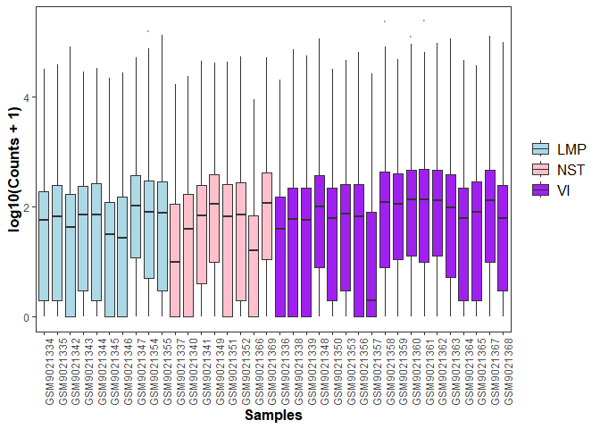
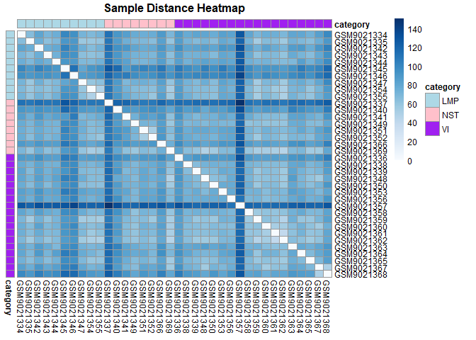
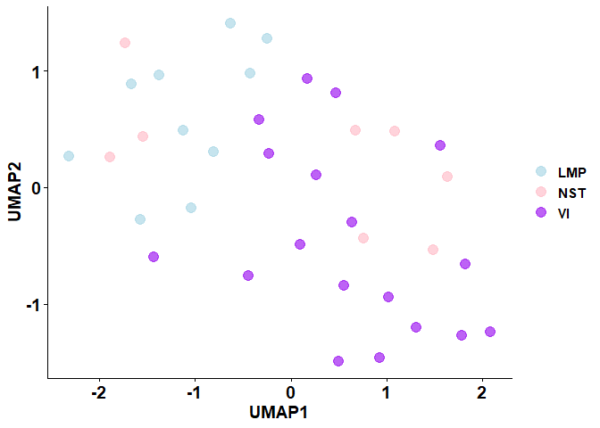
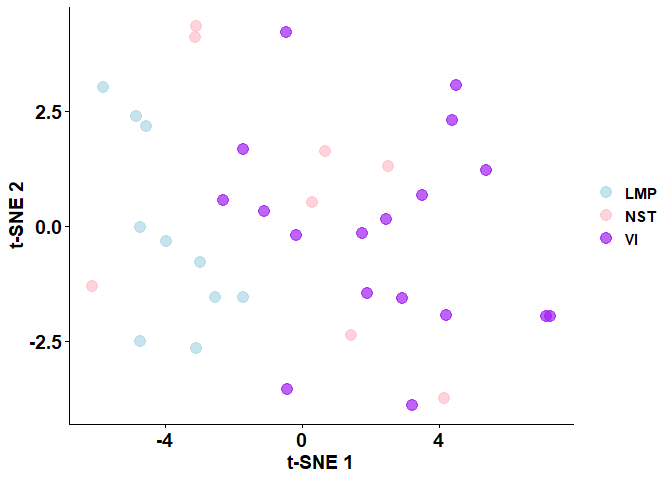
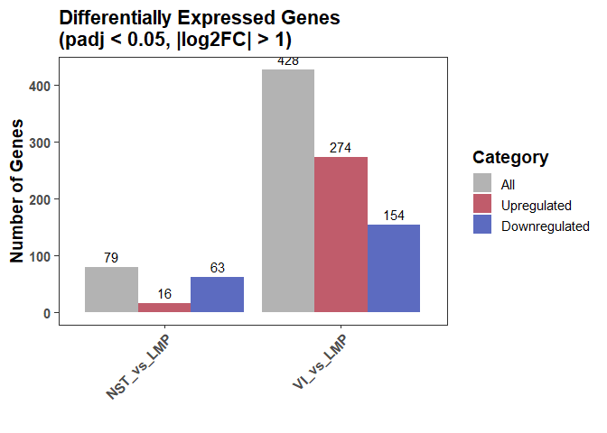
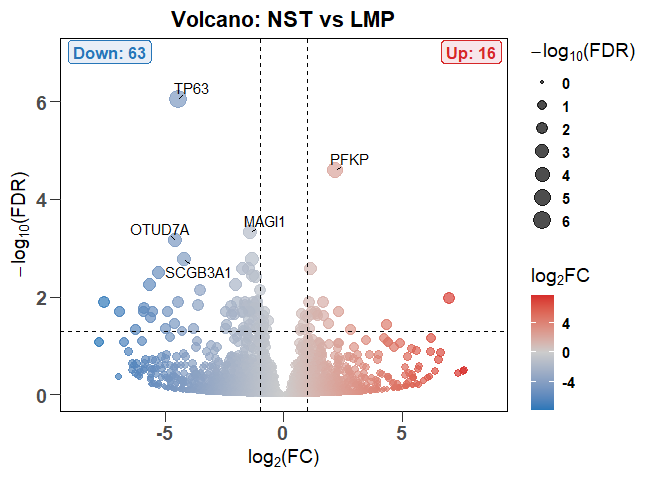
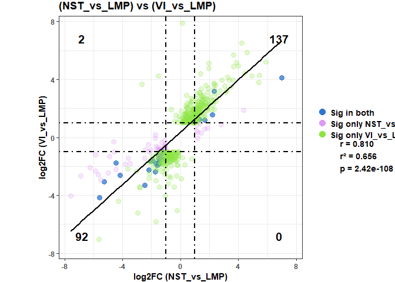
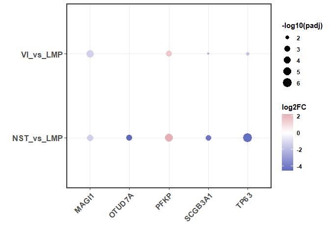
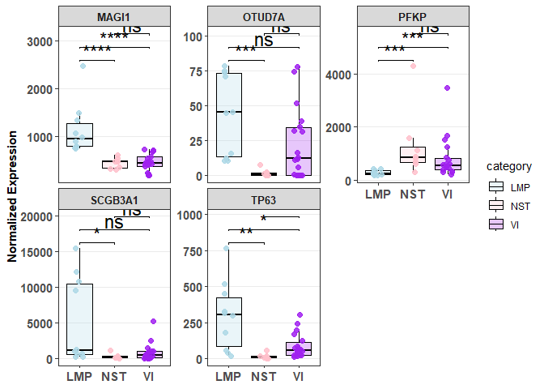
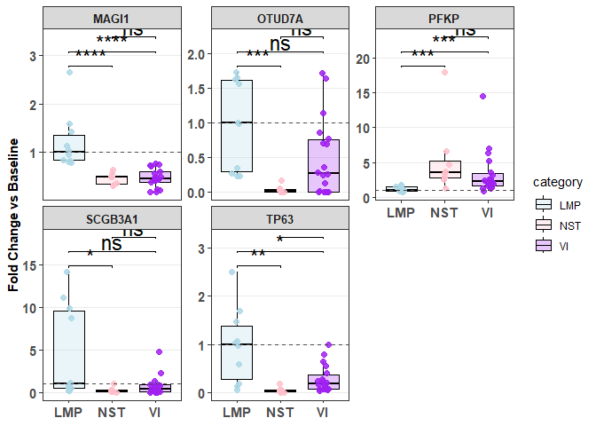

## Real Dataset Analysis: showcasing usage of bulkseqviz library

## Introduction

This tutorial demonstrates an example analysis using `bulkseqviz`.

We will download a raw RNA-seq dataset from the NCBI Gene Expression
Omnibus (GEO), clean the data, and generate publication-ready
visualizations.

The dataset used in this example is
[**GSE298714**](https://www.ncbi.nlm.nih.gov/geo/query/acc.cgi?acc=GSE298714 "null").

## 1. Setup and Libraries

First, we load the core package and necessary helper libraries for data
retrieval and manipulation.

``` r
devtools::install_github("MobinKhoramjoo/bulkseqviz") 
#> These packages have more recent versions available.
#> It is recommended to update all of them.
#> Which would you like to update?
#> 
#> 1: All                           
#> 2: CRAN packages only            
#> 3: None                          
#> 4: rlang  (1.1.6 -> 1.1.7) [CRAN]
#> 5: vctrs  (0.6.5 -> 0.7.1) [CRAN]
#> 6: tibble (3.2.1 -> 3.3.1) [CRAN]
#> 7: xfun   (0.54  -> 0.56 ) [CRAN]
#> 8: purrr  (1.2.0 -> 1.2.1) [CRAN]
#> 9: dplyr  (1.1.4 -> 1.2.0) [CRAN]
#> 
#> ── R CMD build ──────────────────────────────────────────────────────────────────────────────────────────────────────────
#>          checking for file 'C:\Users\mobin\AppData\Local\Temp\RtmpYXCVaz\remotesce87455eb0\MobinKhoramjoo-bulkseqviz-41ceb70/DESCRIPTION' ...  ✔  checking for file 'C:\Users\mobin\AppData\Local\Temp\RtmpYXCVaz\remotesce87455eb0\MobinKhoramjoo-bulkseqviz-41ceb70/DESCRIPTION' (498ms)
#>       ─  preparing 'bulkseqviz':
#>    checking DESCRIPTION meta-information ...     checking DESCRIPTION meta-information ...   ✔  checking DESCRIPTION meta-information
#>       ─  checking for LF line-endings in source and make files and shell scripts
#>   ─  checking for empty or unneeded directories
#>       ─  building 'bulkseqviz_0.1.0.tar.gz'
#>      
#> 
library(bulkseqviz) 
library(GEOquery)   # For downloading data from NCBI 
library(dplyr)      # For data manipulation 
library(ggplot2)    # For plotting 
library(tidyverse)  # General data science tools 
library(biomaRt)    # For gene ID annotation 
```

## 2. Data Retrieval

We start by fetching the metadata (sample information) and the
supplementary count files directly from GEO.

``` r
gse_id <- "GSE298714"

# 1. Fetch Metadata
# We use getGEO to download the phenotype data.
gse <- getGEO(gse_id, destdir = ".", getGPL = FALSE)

# Clean up the metadata. 
# We extract the 'category' (e.g., treatment group) from the characteristics column
# using regex to remove the field name prefix (e.g., "condition: Treated" -> "Treated").
metadata <- pData(gse[[1]]) %>% 
  mutate(category = str_replace(characteristics_ch1.4, ".*:\\s*", ""))

# 2. Fetch Raw Counts
# Download the supplementary files where raw counts are stored
getGEOSuppFiles(gse_id)
#>                                                                                                                  size
#> G:/My Drive/Ongoing Projects/Side Projects/bulkseqviz/vignettes/GSE298714/GSE298714_biopsies_exp_count.txt.gz 1578484
#>                                                                                                               isdir mode
#> G:/My Drive/Ongoing Projects/Side Projects/bulkseqviz/vignettes/GSE298714/GSE298714_biopsies_exp_count.txt.gz FALSE  666
#>                                                                                                                             mtime
#> G:/My Drive/Ongoing Projects/Side Projects/bulkseqviz/vignettes/GSE298714/GSE298714_biopsies_exp_count.txt.gz 2026-02-12 19:13:48
#>                                                                                                                             ctime
#> G:/My Drive/Ongoing Projects/Side Projects/bulkseqviz/vignettes/GSE298714/GSE298714_biopsies_exp_count.txt.gz 2026-02-12 18:22:35
#>                                                                                                                             atime
#> G:/My Drive/Ongoing Projects/Side Projects/bulkseqviz/vignettes/GSE298714/GSE298714_biopsies_exp_count.txt.gz 2026-02-12 18:36:49
#>                                                                                                               exe
#> G:/My Drive/Ongoing Projects/Side Projects/bulkseqviz/vignettes/GSE298714/GSE298714_biopsies_exp_count.txt.gz  no

# Locate the file
supp_files <- list.files(gse_id)
count_file <- paste(gse_id, supp_files, sep = '/')

# Read the table
counts <- read.table(count_file, header = TRUE, row.names = 1, check.names = FALSE)

# Ensure column names in counts match the GEO Accession IDs in metadata
colnames(counts) <- metadata$geo_accession

# Cleanup
rm(gse)
```

## 3. Data Cleaning and Filtering

Raw RNA-seq data often includes non-coding RNAs or pseudogenes. For this
analysis, we want to filter the dataset to keep only **protein-coding
genes** using Ensembl annotations.

``` r
# Connect to Ensembl BioMart
mart <- useMart("ensembl", dataset = "hsapiens_gene_ensembl")

# Retrieve gene biotypes for our rows
genes_info <- getBM(
  attributes = c("ensembl_gene_id", "gene_biotype"),
  filters = "ensembl_gene_id",
  values = rownames(counts),
  mart = mart
)

# Identify protein-coding IDs
protein_coding_ids <- genes_info$ensembl_gene_id[genes_info$gene_biotype == "protein_coding"]

# Filter the count matrix
filtered_counts_df <- counts[rownames(counts) %in% protein_coding_ids, ]

# Data Type Conversion:
# DESeq2 requires integer counts. We convert the dataframe to ensure no floats exist.
filtered_counts_df <- as.data.frame(lapply(filtered_counts_df, as.integer))
rownames(filtered_counts_df) <- protein_coding_ids # Re-assign rownames lost during lapply

# Sanity Check: Do sample names match? 
# Should be matched for making bulkseqviz object
if(!all(colnames(filtered_counts_df) == rownames(metadata))) {
  stop("Mismatch between count columns and metadata rows!")
}
```

## 4. Creating the bulkseqviz Object

We wrap the cleaned counts and metadata into the `bulkseq` object. This
creates a unified container that handles downstream normalization and
plotting automatically.

``` r
bs_obj <- create_bulkseqvis_object(counts = filtered_counts_df, metadata = metadata)

# Print object summary
print(bs_obj)
#> --- BulkSeqVis Object ---
#> Genes: 20050 
#> Samples: 36 
#> Metadata variables: title, geo_accession, status, submission_date, last_update_date, type, channel_count, source_name_ch1, organism_ch1, characteristics_ch1, characteristics_ch1.1, characteristics_ch1.2, characteristics_ch1.3, characteristics_ch1.4, characteristics_ch1.5, characteristics_ch1.6, characteristics_ch1.7, characteristics_ch1.8, characteristics_ch1.9, characteristics_ch1.10, characteristics_ch1.11, characteristics_ch1.12, molecule_ch1, extract_protocol_ch1, extract_protocol_ch1.1, taxid_ch1, description, data_processing, data_processing.1, data_processing.2, data_processing.3, data_processing.4, data_processing.5, data_processing.6, platform_id, contact_name, contact_email, contact_phone, contact_laboratory, contact_department, contact_institute, contact_address, contact_city, contact_state, contact_zip/postal_code, contact_country, data_row_count, instrument_model, library_selection, library_source, library_strategy, relation, supplementary_file_1, age:ch1, biopsy type:ch1, characteristics:ch1, cohort:ch1, gender:ch1, patient id:ch1, procedure:ch1, race:ch1, sample type:ch1, site:ch1, smoking status:ch1, tissue:ch1, tnm 8th edition stage:ch1, category 
#> Sample names: GSM9021334, GSM9021335, GSM9021336, GSM9021337, GSM9021338, GSM9021339 ...
```

## 5. Exploratory Data Analysis (EDA)

Before running statistics, we assess the quality of the data. We define
a custom color palette to keep visualizations consistent across all
plots.

``` r
# Define custom colors
my_color <- c('LMP' = 'lightblue', 'NST' = 'pink', 'VI' = 'purple')
# Define custom order
my_order <- c('LMP', 'NST', 'VI')

# A. Overall Count Distribution
# Checks for library size differences or major outliers
overall_count_boxplot(bs_obj, # created bulkseqviz object
                      color_by = "category",
                      group_order = my_order,
                      group_colors = my_color)
```

<!-- -->

``` r

# B. Sample-to-Sample Distance Heatmap
sample_distance_heatmap(bs_obj, 
                        color_by = "category", 
                        fontsize = 9,
                        title = "Sample Distance Heatmap",
                        ann_colors = list(category = my_color)) 
```

<!-- -->

We explore the data structure using linear (PCA) and non-linear (UMAP,
t-SNE) techniques.

``` r
# PCA (2D)
plot_pca_2d(bs_obj, 
            color_by = "category",
            group_colors = my_color,
            ntop = 500)
```

<!-- -->

``` r

# UMAP
plot_umap_2d(bs_obj, 
             color_by = "category",
             ntop = 500,
             n_neighbors = 10,
             group_colors = my_color)
```

<!-- -->

``` r

# t-SNE
plot_tsne_2d(bs_obj, 
             color_by = "category",
             min_gene_counts = 10,
             ntop = 500,
             tsne_perplexity = 10,
             group_colors = my_color)
```

<!-- -->

## 6. Differential Expression Analysis (DEA)

We perform differential expression analysis using `DESeq2`. Here we
perform two pairwise comparisons against the “LMP” control group.

``` r
# Contrast 1: NST vs LMP
bs_obj <- DEG(bs_obj, 
              design_col = "category", 
              compare_levels = c("NST", "LMP"),
              biomart_dataset = 'hsapiens_gene_ensembl')
#> --------------------------------------
#> Comparison: NST_vs_LMP 
#> Total genes: 16277 
#> Signif (padj < 1 ): 16275 
#> Signif + FC (|log2FC| > 0 ): 16275 
#> --------------------------------------

# Contrast 2: VI vs LMP
bs_obj <- DEG(bs_obj, 
              design_col = "category", 
              compare_levels = c("VI", "LMP"),
              biomart_dataset = 'hsapiens_gene_ensembl')
#> --------------------------------------
#> Comparison: VI_vs_LMP 
#> Total genes: 17016 
#> Signif (padj < 1 ): 16682 
#> Signif + FC (|log2FC| > 0 ): 16682 
#> --------------------------------------
```

## 7. Visualizing Results

``` r
# Bar Plot Summary
plot_deg_bar(bs_obj,
             method = "padj",
             cutoff = 0.05,
             fc_cutoff = 1)
```

<!-- -->

``` r

# Volcano Plot (NST vs LMP)
plot_volcano(bs_obj, 
             comparison_id = "NST_vs_LMP", 
             fc_thresh = 2,
             padj_thresh = 0.05,
             top_labels = 5,
             plot_title = "Volcano: NST vs LMP")
```

<!-- -->

``` r

# Compare two contrasts (FC vs FC)
plot_fcvsfc(bs_obj, 
            name1 = "NST_vs_LMP", 
            name2 = "VI_vs_LMP",
            fc_cutoff = 2)
```

<!-- -->

## 8. Gene-specific Visualization

We select the top 5 significant genes from the first comparison and
visualize their expression.

``` r
# Extract top 5 genes
target_genes <- bs_obj$DE_results$NST_vs_LMP %>% 
  dplyr::arrange(padj) %>% 
  dplyr::slice_head(n=5) %>% 
  dplyr::pull(gene_id)

# Dotplot of Log2 Fold Changes
plot_fc_dotplot(bs_obj, genes = target_genes)
```

<!-- -->

``` r

# Expression Boxplot 
plot_gene_boxplot(bs_obj, 
                  genes = target_genes, 
                  x_var = "category",
                  x_colors = my_color,
                  jitter_points = TRUE,
                  biomart_dataset = 'hsapiens_gene_ensembl') 
```

<!-- -->

``` r

# Expression Boxplot (Baseline Normalized)
plot_gene_boxplot(bs_obj, 
                  genes = target_genes, 
                  x_var = "category",
                  x_colors = my_color,
                  jitter_points = TRUE,
                  normalize_to_baseline = TRUE,
                  biomart_dataset = 'hsapiens_gene_ensembl') 
```

<!-- -->
